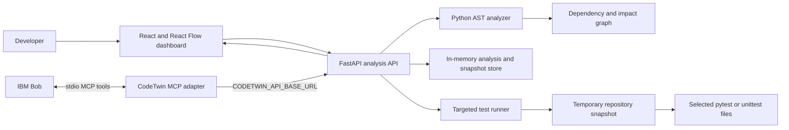

# CodeTwin Architecture

## Design principles

- Make repository facts reproducible: file parsing, dependency edges, reachability, and test selection are deterministic for a fixed snapshot.
- Treat IBM Bob's semantic review as an agent judgment, not a deterministic prediction.
- Keep predicted impact, Bob-confirmed impact, possible impact, not affected, and executed test results as separate evidence.
- Validate a captured snapshot. Do not silently substitute the current working tree between review and test execution.
- Fail closed: missing evidence, analysis errors, unresolved possible impact, or failing checks prevent **Safe to Merge**.
- Keep the prototype local and small: a FastAPI backend, a React UI, one synthetic e-commerce repository, and no additional service infrastructure.

## Component overview



The repository snapshot and changed-file list enter through the API or Bob's `analyze_change` MCP tool. Both paths call the same FastAPI service and session store. The analyzer creates a prediction and a session. When a session originates in the UI, Bob's `get_analysis_context` tool loads that exact session and snapshot; `submit_bob_impact_review` records Bob's classifications. Bob or the UI can then invoke `run_targeted_tests`. The API derives the final status from recorded evidence.

## Backend architecture

### Analysis API and session store

The FastAPI application in `backend/codetwin/api.py` accepts relative repository paths and UTF-8 source text. It exposes stateless prediction and stateful analysis-session routes. The prototype stores reports and captured snapshots in process memory; restarting the service clears them. A corrected demo run creates a new session linked to its parent so the earlier failure remains inspectable.

IBM Bob launches `backend/run_bob_mcp.py` as a local stdio child process using `.bob/mcp.json`. Since that MCP process is separate from FastAPI, `api_client.py` sends each tool request to the configured `CODETWIN_API_BASE_URL`. The UI and Bob therefore read and update the same API-owned session rather than separate in-memory copies. The API origin is required configuration; the MCP adapter has no built-in host fallback.

`analysis_store.py` coordinates prediction, Bob review, and test execution. It enforces that Bob classifies every analyzed Python file exactly once, that the changed files are Bob-confirmed, and that each classification belongs to the analyzed snapshot. It retains the prediction independently of Bob's review.

### Deterministic repository analysis

`analyzer.py`:

1. Normalizes and validates repository-relative paths.
2. Maps Python package/module paths to repository files.
3. Parses Python files with `ast.parse` and records syntax errors.
4. Resolves supported absolute and relative `import` and `from ... import ...` relationships that match files in the snapshot.
5. Records each dependency edge as **importer → imported dependency**.
6. Traverses reverse edges from changed files to find downstream importers, including transitive dependents.
7. Resolves supported function and method definitions/calls into symbol-level edges, associates each impacted symbol with its file, and classifies files as tests, API files, or source files using path and AST heuristics.

The predicted impact includes changed files and their reachable dependents. Tests are selected from those impacted files. Python source files outside that closure are returned as unpredicted files for Bob to assess; they are not automatically declared semantically unaffected.

Analysis is deterministic for the same normalized snapshot and changed-file list. Static imports cannot reliably expose dynamic imports, runtime plugin loading, reflection, generated code, or every framework convention. API detection is a source heuristic. Parse errors remain explicit and block a safe result.

Symbol resolution is intentionally bounded to statically identifiable Python definitions, direct calls, and imported aliases found in the snapshot. It does not claim to resolve arbitrary dynamic dispatch, monkey-patching, or runtime-generated call targets.

### Impact graph

Graph nodes represent Python files and resolved functions/methods. Edges capture file imports and supported symbol references. Analyzer dependency edges point from an importer to its dependency; impact travels in reverse from the changed dependency to downstream importers. The UI draws impact direction and links symbol impacts to their containing files. Node appearance may show Bob's assessment, but predicted membership remains based on deterministic analysis.

### IBM Bob validation workflow

The project-level `.bob/mcp.json` registers CodeTwin's stdio MCP server. `.bob/rules-code/codetwin-impact-validation.md` guides Bob to use it as an active reviewer. It exposes:

- `analyze_change` to create a prediction from files Bob read in the open repository.
- `get_analysis_context` to load the exact snapshot and report for an existing UI/API session.
- `submit_bob_impact_review` to save complete, non-overlapping semantic file classifications and rationale.
- `run_targeted_tests` to execute predicted tests after review.

The intended UI flow creates the session, then Bob reviews its ID. Bob inspects the changed source and predicted dependents, checks for semantic effects outside the graph, and classifies all analyzed files as Bob-confirmed impact, possible impact, or not affected. CodeTwin records the three groups separately from AST output. Possible impact must be resolved before the merge gate can open.

### Targeted tests and regression status

`test_runner.py` writes the captured snapshot under a temporary directory and executes only the selected Python test files. It prefers pytest when available and falls back to unittest for the self-contained demo. It gives each test file a timeout, trims subprocess environment variables, caps returned output, and rejects paths that escape the temporary snapshot.

- A selected test that fails produces **Regression detected**.
- No selected tests, test errors or timeouts, and Python parse errors have distinct blocking statuses.
- A passing test is evidence only for the test that actually ran.
- A corrected revision receives a new analysis ID and must pass Bob review and targeted tests again.
- **Safe to Merge** requires completed Bob review with no possible impact, no parse errors, at least one selected test, and passing results for every selected test.

## Frontend architecture

`frontend/` is a React and TypeScript application built with Vite. `App.tsx` owns the analysis session, API requests, polling, test action, and status display. `types.ts` describes the API report shape. `ImpactGraph.tsx` maps dependency edges and evidence into an accessible SVG graph with deterministic columns and downstream arrows. `styles.css` contains the responsive dashboard styling. The API origin is supplied at build time through `VITE_API_BASE_URL`; the frontend has no production fallback host.

The UI starts the payment demo, displays the changed file and predicted impact, provides the analysis ID for Bob, and polls while Bob review or test execution is pending. Bob's review and test output are shown in separate sections. Merge status comes from the backend; the frontend does not infer safety on its own.

## Demo repository and scenario

`examples/ecommerce/` is a synthetic FastAPI shop with authentication, users, products, orders, payments, notifications, route modules, services, an in-memory database/repository layer, and tests. The original payment flow transitions `pending → completed`. The changed flow introduces `pending → authorized → completed`, while a downstream notification component still assumes the old direct transition. A workflow test catches that stale assumption. The correction demo fixes the consumer in a new captured revision; Bob and the targeted test must run again.

The checked-in fixture remains the passing baseline. The API applies the regression and fix to in-memory snapshots so the demonstration does not edit fixture files.

## Testing strategy

- **Analyzer unit tests:** deterministic output, transitive dependents, API and test classification, invalid paths, and parse errors.
- **API/session tests:** request validation, report state transitions, complete Bob classifications, CORS, and snapshot retention.
- **Test-runner tests:** selected test execution, failure/error behavior, timeout/path boundaries, and output reporting.
- **MCP protocol tests:** tool registration and a separate-process review/test flow through the same FastAPI session store.
- **E-commerce fixture tests:** baseline checkout behavior passes; the deliberate patch fails the payment workflow assertion; the corrected snapshot passes after a fresh review.
- **Frontend checks:** TypeScript project build and Vite production build; manually confirm graph, review, test, and merge states against a running API and IBM Bob MCP session.

## Initial repository structure

```text
.
├── .bob/                         # Project-level IBM Bob MCP configuration and review guidance
├── backend/
│   ├── codetwin/                  # FastAPI, analyzer, session store, MCP server, test runner
│   └── tests/                     # Backend and API tests
├── examples/
│   └── ecommerce/
│       ├── app/                   # Synthetic FastAPI e-commerce application
│       ├── tests/                 # Demo API and payment workflow tests
│       ├── scenarios/             # Deliberate regression patch
│       └── scripts/               # Regression reproduction helper
├── frontend/
│   └── src/                       # React dashboard, graph, types, and styles
├── render.yaml                    # Render backend service blueprint
├── .python-version                # Render and local Python runtime selection
├── ARCHITECTURE.md
├── PRODUCT_SPEC.md
└── README.md
```

## Deployment architecture

The frontend is built from `frontend/` for Vercel using `frontend/vercel.json`. The backend is a single-instance Python web service on Render described by the root `render.yaml`, with a `GET /health` check. The frontend reads its backend origin from `VITE_API_BASE_URL`; the backend reads the allowed frontend origin from `FRONTEND_ORIGINS`. Production builds must not use localhost as a fallback. The public Render service runs with `CODETWIN_DEMO_ONLY=true`, restricting source submission and test execution to the checked-in synthetic payment scenario. The process-local session store makes public demo sessions temporary. Local development may use an API origin configured through ignored environment files. The README will carry the actual public Live Demo URL after deployment succeeds.

## Git workflow

Implement one reviewable stage at a time. Before committing, inspect `git status`, run checks relevant to the changed stage, inspect `git diff`, and run `git diff --check`. Keep unrelated work out of the commit. Use a conventional commit message, exclude secrets and generated environments/artifacts, and do not push unless the user explicitly requests it.
